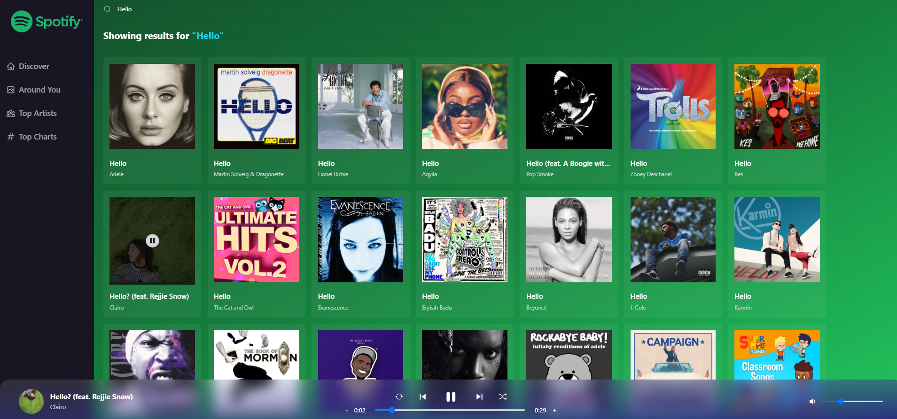

# Spotify-clone

Spotify-Clone is an elegant music application built using modern technologies such as React, Redux Toolkit, Tailwind CSS, and Vite, which provides a fast and interactive user experience, allowing users to search for music, create playlists, and enjoy their favorite tracks.

## Built with

- [React](https://reactjs.org/);
- [React Router DOM](https://reactrouter.com/en/main/route/route);
- [TailwindCSS](https://tailwindcss.com/);
- [Swiper](https://swiperjs.com/);
- [Axios](https://axios-http.com/);
- [React Icons](https://react-icons.github.io/react-icons/);

## How to use the program?

1. Clone the repository: ``` https://github.com/makskhv21/Spotify-clone.git ```
2. Install dependencies: ``` npm install ```
3. Start the server: ``` npm start ```
4. Open a web browser and paste url: ``` http://localhost:3000/ ```

